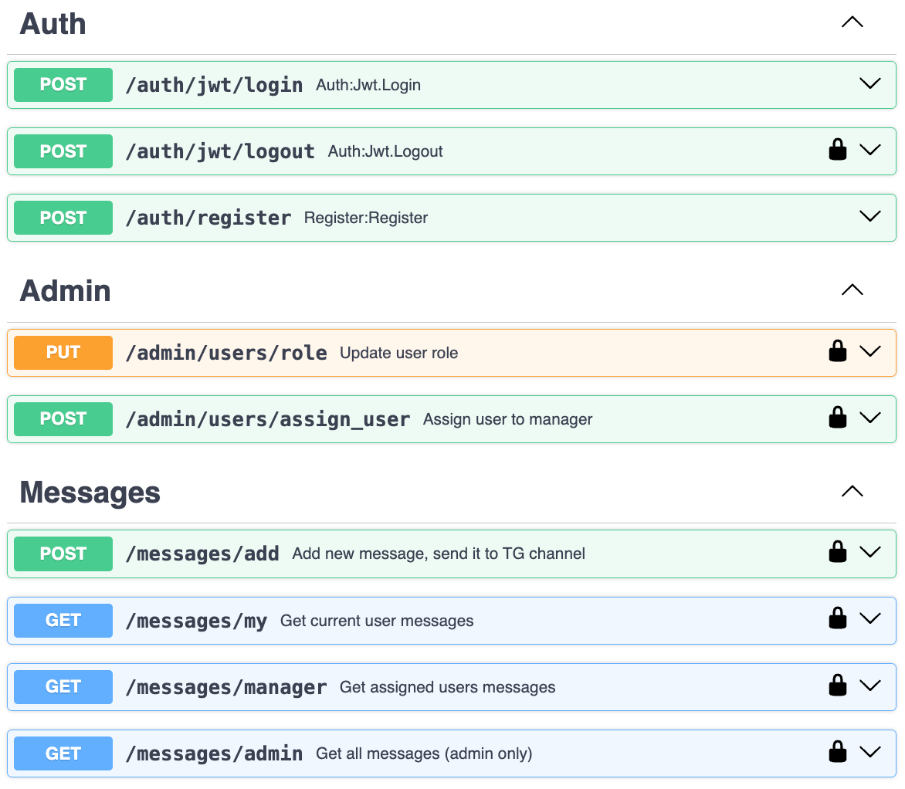

# tg_traffic
Traffic Devils test task

## Description
- A FastAPI service that also uses PostgreSQL, fastapi-users, sqlalchemy and alembic, including a basic role system, processing and saving requests, and sending messages to Telegram.
- The application will be available at http://localhost:8005/docs.


## Prerequisites

- Docker & Docker Compose: [Install Docker](https://docs.docker.com/get-docker/)

# Test users:

| Username         |  Password | Role    |
|------------------|---|---------|
| admin@test.com   | strongpassword | admin   |
| manager@test.com | strongpassword | manager |
| user1@test.com   | strongpassword | user    |
| user2@test.com   | strongpassword | user    |
| user3@test.com   | strongpassword | user    |


## Setup Instructions

1. **Clone the Repository**
```bash
git clone https://github.com/roman-zahoruiko/tg_traffic.git tg_traffic-roman-zahoruiko
cd tg_traffic-roman-zahoruiko
```
2. Build and Run the Application
```bash
docker-compose up --build
```
3. Restore Database from SQL Dump:
```bash
docker compose cp tg_traffic.sql db:/tg_traffic.sql
docker compose exec -it db pg_restore -U postgres -d tg_traffic /tg_traffic.sql
```
4. Access the Application

- The **FastAPI** application will be available at http://localhost:8005/docs.
- The **PostgreSQL** database will be accessible on localhost:5435.
